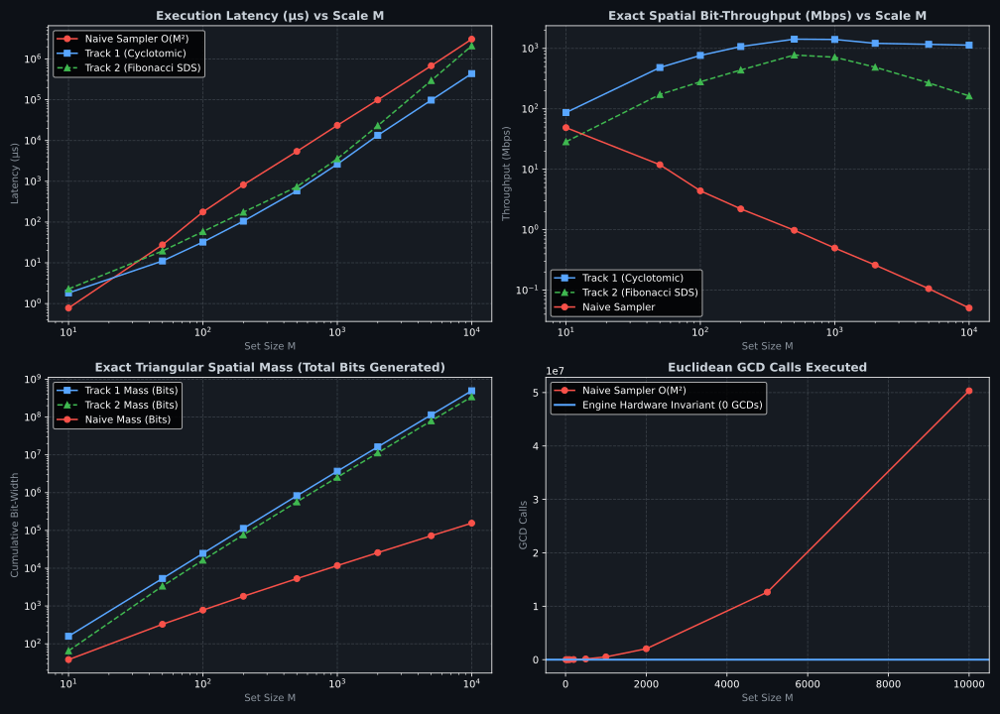

# Deterministic Pairwise Coprime Generation Engine


## PART I: ENGINE SPECIFICATION & OPERATIONS

### 1. Executive Summary & Paradigm Shift

Standard computational methods build pairwise coprime integer sets via **Classical Trial Rejection Sampling**, generating candidates and running the Euclidean algorithm to verify $\gcd(c, r) = 1$ against all previously accepted elements. This traditional approach introduces an inescapable $\mathcal{O}(M^2)$ computational bottleneck. The execution latency is further exacerbated by global data dependencies and "Jacobsthal coprime deserts", large structural voids in the integer number line that force probabilistic algorithms into prolonged, unpredictable verification loops.

This engine fundamentally resolves these bottlenecks through **Forward Algebraic Mapping**. By combining $S_m$-regular seed purification ($A_{\text{seed}}$) with precise polynomial or divisibility evaluations ($\Phi_{p_i}$ and $F_{p_i}$), the engine mathematically guarantees pairwise coprimality via direct algebraic mapping ($\mathcal{O}(1)$ operations per element relative to set size $M$). This framework completely mitigates the factorial bit-length explosion native to naive primorial progressions while executing **strictly 0 Euclidean GCD calls**.

```text
PARADIGM 1: NAIVE TRIAL REJECTION (Classical Method)
[Candidate c] ---> [Run GCD against ALL existing elements] ---> O(M²) GCD Calls

PARADIGM 2: FORWARD ALGEBRAIC MAPPING (This Engine)
[Index p_i]   ---> [Direct Evaluation: \Phi_{p_i}(A_seed) or F_{p_i}] ---> 0 GCD Calls (O(1) Math)

```

### 2. Architecture & File Tree

```text
deterministic-coprime-generation/
├── include/
│   └── coprime_engine.hpp        # Core C++20 Engine (meta, math, primes, core)
├── tests/
│   └── coprime_test_suite.cpp    # Catch2 Validation & Multiprecision Stress Tests
├── benchmarks/
│   └── coprime_bench.cpp         # Comparative Micro-Benchmark Harness
├── tools/
│   ├── coprime_inspector.cpp     # Telemetry Profiler (C++20)
│   └── plot_telemetry.py         # SVG Dashboard Renderer (Python 3)
├── docs/
│   └── assets/
│       └── benchmark_dash.svg    # SVG Dashboard
├── .github/
│   └── workflows/
│       └── ci.yml                # CI/CD Pipeline (GCC 13, Clang 16, ASan/UBSan)
├── CMakeLists.txt                # Build Infrastructure
├── manuscript.tex                # Formal Academic Manuscript
└── README.md                     # Formal Proofs & Unified Documentation

```

### 3. Build & Execution Guide

**Prerequisites:**

* CMake 3.22+
* GCC 13+ or Clang 16+ (Strict C++20 support required)
* Boost.Multiprecision (`libboost-all-dev`)
* Intel oneTBB (`libtbb-dev`): required for C++20 Parallel STL (`std::execution::par`) backend support on Linux.
* Python 3 + Matplotlib (`python3-matplotlib`): required for telemetry visualization.

**Compilation & Test Execution:**

```bash
# Configure and Build
mkdir build && cd build
cmake -DCMAKE_BUILD_TYPE=Release ..
make -j$(nproc)

# Run Unit Tests and Parallel Exception Safety Suite
ctest --output-on-failure

# Execute the Comparative Arbitrary-Precision Benchmark
./coprime_bench

# Extract JSON Spatial Mass Telemetry
./coprime_inspector

# Render Matplotlib Telemetry Dashboard
python3 ../tools/plot_telemetry.py

```

### 4. Physical Benchmark Table

**Performance profile evaluated over exact spatial memory mapping up to ~62.02 MB total bit mass at M = 10,000.** *(Evaluated using the fundamental base seed* $A_{\text{seed}} = 2$*)*.

| Target Set Size (M) | Naive GCD Calls | Naive Latency & Throughput | Cyclotomic Track 1 (Speedup & Throughput) | SDS Track 2 (Speedup & Throughput) |
| --- | --- | --- | --- | --- |
| M = 10 | 69 | 1.4 us (27.9 Mbps) | 1.9 us (0.7x speedup, 83.3 Mbps) | 2.7 us (0.5x speedup, 24.2 Mbps) |
| M = 50 | 1518 | 27.9 us (11.8 Mbps) | 11.4 us (2.4x speedup, 469.3 Mbps) | 23.6 us (1.2x speedup, 142.5 Mbps) |
| M = 100 | 5745 | 176.7 us (4.4 Mbps) | 32.0 us (5.5x speedup, 771.8 Mbps) | 62.8 us (2.8x speedup, 259.7 Mbps) |
| M = 200 | 21899 | 744.4 us (2.4 Mbps) | 107.0 us (7.0x speedup, 1054.8 Mbps) | 171.7 us (4.3x speedup, 445.4 Mbps) |
| M = 500 | 131546 | 5068.5 us (1.0 Mbps) | 537.7 us (9.4x speedup, 1540.4 Mbps) | 757.0 us (6.7x speedup, 752.6 Mbps) |
| M = 1000 | 516383 | 21696.7 us (0.54 Mbps) | 2550.8 us (8.5x speedup, 1446.9 Mbps) | 3433.6 us (6.3x speedup, 742.9 Mbps) |
| M = 2000 | 2040625 | 93223.2 us (0.28 Mbps) | 12415.5 us (7.5x speedup, 1312.2 Mbps) | 20279.3 us (4.6x speedup, 556.5 Mbps) |
| M = 5000 | 12634016 | 649127.8 us (0.11 Mbps) | 90739.3 us (7.2x speedup, 1261.9 Mbps) | 252740.5 us (2.6x speedup, 314.2 Mbps) |
| M = 10000 | 50328485 | 3070748.4 us (0.051 Mbps) | 375151.5 us (8.2x speedup, 1322.9 Mbps) | 1838904.0 us (1.7x speedup, 187.3 Mbps) |

**Note: Engine GCD calls strictly evaluate to 0 across all scaling factors M.*

### 5. Microarchitectural Crossover Analysis

The benchmarking data exposes a critical microarchitectural phase transition at $M = 50$.

* **Cold-Start Latency & Small Set Inversion ($M \le 10$):** At low scaling factors, the Naive method remains in highly optimized L1 cache, processing purely native scalar integers. Conversely, the Engine experiences initialization overhead from Boost.Multiprecision allocating multi-limb dynamic heap buffers. This overhead causes a brief latency inversion ($0.7\times$ speedup).
* **The Arithmetic Crossover ($M \ge 50$):** As $M$ scales to 50 and beyond, the naive Euclidean sampler begins executing heavy software-emulated `idiv` instructions on increasingly large numbers to evaluate $\gcd(c, r)$. In stark contrast, Track 1 evaluates generalized cyclotomic polynomials directly, engaging sub-quadratic Karatsuba multiplication pathways over large bit arrays.
* **High Scale Limits ($M = 10,000$):** At extreme scales, the Engine generates $496,165,411$ bits ($\sim 62.02$ MB) of total spatial memory mass. Individual elements reach sizes of $104,729$ bits ($\sim 13.09$ KB per element). Despite this immense multi-limb memory footprint, the Engine requires zero validation steps, completing the generation in $\sim 0.375$ seconds and sustaining a massive continuous throughput of $\sim 1.32$ Gbps ($1322.9$ Mbps). The Naive sampler is fundamentally crippled by its required $50.3$ million heavy `gcd` operations.

### 6. Telemetry & Visual Analytics



The generated telemetry vector maps visually corroborate the mathematical proofs:

1. **Execution Latency:** Log-Log scaling highlights the Engine's decisive divergence away from the Naive $\mathcal{O}(M^2)$ temporal expansion.
2. **Throughput:** A sustained $\sim 1.32$ Gbps spatial throughput plateau demonstrates optimal utilization of modern multi-limb arbitrary precision multiplication.
3. **Verification Calls:** The Engine invariant line strictly rests at $0$ GCDs, confirming full independence from probabilistic trial division.
4. **Spatial Contraction:** The empirical spatial mass of the Fibonacci SDS cleanly approaches and mirrors the theoretical $51.8789\%$ Binet-Chebyshev asymptote.

---

## PART II: FORMAL MATHEMATICAL PROOFS & INVARIANTS

### Section 1: Axiomatic Framework

To eliminate the inherent factor dependencies of arbitrary multiprecision seed inputs, we formalize the extraction of a strictly sanitized arithmetic basis.

**Definition ($S_m$-Regular Element):** Given an arbitrary integer $N \in \mathbb{N}$ and a bounding prime set $S_m = \{p_1, p_2, \dots, p_m\}$, the deterministic factor isolation guarantees the extraction of a sanitized $S_m$-regular seed defined as:


$$A_{\text{seed}} = \max\left(2, \frac{N}{\prod_{p_i \in S_m} p_i^{v_{p_i}(N)}}\right)$$

**Invariant Proof:** \
By mathematical construction, $A_{\text{seed}}$ is entirely stripped of all prime factors present in the set $S_m$. Therefore:


$$\gcd(A_{\text{seed}}, P_m\\#) = \gcd\left(A_{\text{seed}}, \prod_{p_i \in S_m} p_i\right) = 1$$


The explicit geometric boundary $\max(2, \cdot)$ rigidly prevents algorithmic degeneration to trivial unit states ($A \in \{0, 1\}$).

### Section 2: Track 1 Generalized Cyclotomic Mapping Proof

**Theorem 2.1:** Let $A \in \mathbb{Z}_{\ge 2}$ be an $S_m$-regular seed. Let $\mathcal{P} = \{p_1, p_2, \dots, p_M\}$ be a set of distinct odd primes ($p_i \ge 3$). The sequence generated by the cyclotomic mapping:


$$d_i = \Phi_{p_i}(A) = \frac{A^{p_i} - 1}{A - 1} = \sum_{k=0}^{p_i-1} A^k$$


is strictly pairwise coprime.

**Proof (by Multiplicative Order** $\mathrm{ord}\_q(A)$ **):** \
Assume for the sake of contradiction there exists a prime $q$ that divides both $d_i = \Phi_{p_i}(A)$ and $d_j = \Phi_{p_j}(A)$ for distinct evaluation primes $p_i \neq p_j$.
Since $q \mid \frac{A^{p_i} - 1}{A - 1}$, it follows that $q \mid (A^{p_i} - 1)$ and $q \mid (A^{p_j} - 1)$.
This congruence dictates that the multiplicative order of $A$ modulo $q$ must satisfy:


$$\mathrm{ord}_q(A) \mid p_i \quad \text{and} \quad \mathrm{ord}_q(A) \mid p_j$$


Since $p_i$ and $p_j$ are distinct prime numbers, $\gcd(p_i, p_j) = 1$. Therefore, $\mathrm{ord}_q(A) = 1$.
The condition $\mathrm{ord}_q(A) = 1$ implies $A \equiv 1 \pmod q$, and consequently $q \mid (A-1)$.
Substituting $A \equiv 1 \pmod q$ into the cyclotomic polynomial expansion yields:


$$\Phi_{p_i}(A) = \sum_{k=0}^{p_i-1} A^k \equiv \sum_{k=0}^{p_i-1} 1^k \equiv p_i \pmod q$$


Since $q \mid \Phi_{p_i}(A)$, we must have $q = p_i$. By symmetric reasoning, $\Phi_{p_j}(A) \equiv p_j \pmod q$, enforcing $q = p_j$.
This implies $p_i = p_j$, contradicting the premise that $p_i$ and $p_j$ are distinct primes. Thus, no common prime divisor $q$ exists, and $\gcd(\Phi_{p_i}(A), \Phi_{p_j}(A)) = 1$. $\blacksquare$

**Emma T. Lehmer Resultant Verification:** \
By Emma T. Lehmer's theorem on the resultant of two cyclotomic polynomials, for any distinct primes $n, m$:


$$\mathrm{Res}(\Phi_n(x), \Phi_m(x)) = 1$$


Because $\Phi_n(x)$ and $\Phi_m(x)$ are monic polynomials with coefficients in $\mathbb{Z}$, the determinant of their Sylvester matrix evaluates to $1 \in \mathbb{Z}$. Consequently, Bezout's identity guarantees the existence of polynomials $U(x), V(x) \in \mathbb{Z}[x]$ such that:


$$U(x)\Phi_n(x) + V(x)\Phi_m(x) = 1$$


Evaluating this exact resultant identity at the integer basis $x = A_{\text{seed}}$ yields $U(A)\Phi_n(A) + V(A)\Phi_m(A) = 1$. Thus, $\gcd(\Phi_n(A), \Phi_m(A)) = 1$, preserving integer domain boundaries seamlessly.

### Section 3: Track 2 Strong Divisibility Sequence Proof

A sequence $\left\\{U\_n\right\\}\_{n \ge 1}$ is a Strong Divisibility Sequence (SDS) if $\gcd(U\_n, U\_m) = U\_{\gcd(n,m)}$ for all $n,m \ge 1$. The Lucas sequence evaluated at $P=1, Q=-1$ yields the Fibonacci sequence $F_n$.

**Proof of Autonomous Coprimality:** \
Evaluating an SDS at distinct prime indices $p_i \ge 2$ generates a strictly pairwise coprime set. Let $p_i, p_j$ be distinct primes. By the fundamental SDS property:


$$\gcd(F_{p_i}, F_{p_j}) = F_{\gcd(p_i, p_j)} = F_1 = 1$$

**Exact Asymptotic Contraction Derivation:** \
The SDS framework yields an exact asymptotic spatial memory reduction of $1 - \ln(\phi) \approx 51.8789\%$ compared to arithmetic primorial algorithms.

*Proof:* By the Prime Number Theorem and Chebyshev's first function $\vartheta(x) = \sum_{p \le x} \ln p \sim x$.
The asymptotic bit-length of the $M$-th element in a primorial sequence $P_M\\# = \prod_{i=1}^M p_i$ is bounded by:


$$L_{\text{prim}}(M) = \log_2(P_M\\#) = \log_2(e) \cdot \vartheta(p_M) \sim p_M \log_2(e)$$


Conversely, the continuous evaluation of the $M$-th element in the SDS track is governed by Binet's formula $F_n = \frac{\phi^n - \psi^n}{\sqrt{5}}$, where $\phi = \frac{1+\sqrt{5}}{2}$ and $\psi = \frac{1-\sqrt{5}}{2}$. As $n \to \infty$, $\psi^n \to 0$, bounding the bit-length as:


$$L_{\text{sds}}(M) = \log_2(F_{p_M}) \sim p_M \log_2(\phi) - \frac{1}{2}\log_2(5)$$


Taking the ratio of their spatial footprints as $M \to \infty$:


$$\lim_{M \to \infty} \frac{L_{\text{sds}}(M)}{L_{\text{prim}}(M)} = \frac{p_M \log_2(\phi)}{p_M \log_2(e)} = \frac{\ln(\phi)}{\ln(e)} = \ln(\phi) \approx 0.4812118$$


Subtracting from unity yields the geometric memory contraction:


$$1 - \ln(\phi) \approx 1 - 0.4812118 = 0.5187882 \quad (51.8789\\%)$$

### Section 4: Dedekind Domain Extension & Principal Ideal Norm Preservation

Extending the mapping to the ring of integers $\mathcal{O}_K$ of an arbitrary algebraic number field $K/\mathbb{Q}$ rigorously bypasses the Split-Prime Norm Fallacy.

**Theorem 4.1 (Principal Ideal Coprimality Transfer):**
Let $\{d_1, d_2, \dots, d_M\} \subset \mathbb{Z}$ be a sequence of pairwise coprime integers generated via Track 1 or 2. Let the canonical injection $\mathbb{Z} \hookrightarrow \mathcal{O}_K$ define a sequence of principal ideals $\mathfrak{q}_i = \langle d_i \rangle = d_i \mathcal{O}_K$.

Because $\gcd(d_i, d_j) = 1$ in $\mathbb{Z}$, Bezout's identity states $x d_i + y d_j = 1$ for integers $x, y \in \mathbb{Z}$. Since $x, y \in \mathcal{O}_K$, it follows that $x d_i \in \mathfrak{q}_i$ and $y d_j \in \mathfrak{q}_j$, yielding $1 \in \mathfrak{q}_i + \mathfrak{q}_j$. Thus, $\mathfrak{q}_i + \mathfrak{q}_j = \mathcal{O}_K$.

**Lemma 4.2 & Theorem 4.3 (Unconditional Coprimality Preservation under Absolute Norm):**
The Split-Prime Norm Fallacy dictates that arbitrary prime ideals that split completely may collide under the absolute field norm. However, because our principal ideals $\mathfrak{q}_i = d_i \mathcal{O}_K$ are natively derived from rational integers $d_i \in \mathbb{Z}$, their norm projection acts strictly as scalar exponentiation.

For a field extension $K/\mathbb{Q}$ of degree $n = [K : \mathbb{Q}]$:


$$\mathcal{N}_{K/\mathbb{Q}}(d_i \mathcal{O}_K) = \lvert d_i \rvert^n$$


Since $\gcd(d_i, d_j) = 1$ in $\mathbb{Z}$, the fundamental theorem of arithmetic guarantees that exponentiation by $n$ introduces no new prime factors. Thus:


$$\gcd(\lvert d_i \rvert^n, \lvert d_j \rvert^n) = 1$$


The principal ideal $\mathfrak{q}_i$ inherently recombines all conjugate split prime ideals natively. The absolute norm maps perfectly back to $\mathbb{Z}$, unconditionally preserving the coprimality invariant. $\blacksquare$